# Instalacja i konfiguracja systemu Xubuntu w środowisku VirtualBox

## Systemy GNU/Linux

Linux to tak naprawdę nazwa darmowego, otwartego jądra systemu uniksopodobnego. Potocznie nazywa się tak jednak całą rodzinę systemów opartych na tym jądrze. Samo jądro nie stanowi kompletnego, nadającego się do użytku systemu operacyjnego, dlatego dołączono do niego narzędzia i biblioteki z projektu GNU, stąd właściwa nazwa rodziny systemów: GNU/Linux.

Systemy linuksowe dostarczane są w formie dystrybucji takich jak Ubuntu, Debian czy Fedora, z których każda składa się z jądra oraz zestawu pakietów oprogramowania dobranego przez twórców danej dystrybucji.

Podczas zajęć posługiwać będziemy się dystrybucją **Xubuntu** w wersji **20.04 LTS**, która jest odmianą bardzo popularnej dystrybucji Ubuntu, jednak z lekkim interfejsem graficznym XFCE doskonale nadającym się do pracy w środowisku wirtualizowanym lub na nieco starszych komputerach.

Większość operacji oraz poleceń prezentowanych podczas zajęć jest uniwersalna i powinna działać bez zmian lub z drobnymi modyfikacjami pod większością dystrybucji (wyjątki zostaną wyróżnione).

## Maszyny wirtualne

Aby ułatwić poznanie nowego systemu, zainstalujemy go na maszynie wirtualnej.

Tworząc maszynę wirtualną, nasz komputer będzie "symulował" istnienie zasobów, które tworzą kompletny komputer - chipsetu płyty głównej, dysków, karty graficznej, interfejsów sieciowych. Wirtualizacja nie jest emulacją - w przeciwieństwie do emulacji, goszczony system operacyjny będzie miał niemal bezpośredni dostęp do fizycznego procesora w komputerze. 

Dzięki temu unikniemy ryzyka uszkodzenia głównego systemu operacyjnego, na którym pracujemy na co dzień, bądź utraty plików. Będziemy również w stanie uruchomić - poza systemem głównym (*host*) - jeden lub więcej system "gościa" (*guest*) jednocześnie.

Do zarządzania i uruchamiania maszyn wirtualnych potrzebujemy *hypervisora*. Wykorzystamy projekt **VirtualBox**, który wspiera wiele goszczonych systemów operacyjnych i działa pod popularnymi systemami hosta (Windows, macOS i wiele dystrybucji Linuksa).

## Instalacja programu VirtualBox

* Pobierz ze strony https://www.oracle.com/virtualization/technologies/vm/downloads/virtualbox-downloads.html
    * z sekcji **Oracle VM VirtualBox Base Packages** plik instalacyjny dla danego systemu operacyjnego **hosta** (zazwyczaj Windows)
    * z sekcji **Oracle VM VirtualBox Extension Pack** pakiet dodatków (plik wspólny dla wszystkich platform)

* Zainstaluj program zostawiając domyślne ustawienia.
    * System zapyta o zezwolenie na instalację sterowników interfejsów sieciowych, potwierdź zgodę.

* Zainstaluj dodatki otwierając pobrany plik z rozszerzeniem *vbox-extpack* za pomocą aplikacji **VirtualBox Manager** i postępując zgodnie z poleceniami na ekranie.

## Tworzenie maszyny wirtualnej

Uruchom program VirtualBox.

Kliknij przycisk *New* z paska narzędziowego. W kolejnych etapach okna dialogowego:

* Wprowadź nazwę maszyny wirtualnej (nazwa może być dowolna, warto aby reprezentowała typ bądź przeznaczenie danej maszyny). Na potrzeby zajęć nazwę ustaw np. na *Xubuntu 20.04 SCR*.
* Wybierz typ instalowanego systemu operacyjnego oraz architekturę - Linux / Ubuntu 64-bit - VirtualBox stara się rozpoznać typ systemu po nazwie maszyny.

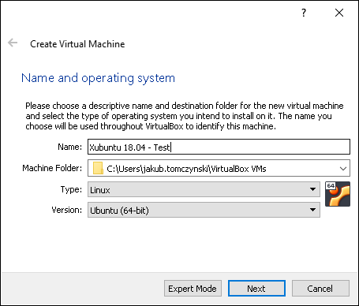

* Ustaw ilość pamięci RAM, jaką otrzyma maszyna wirtualna. Pamiętaj, że system hosta i maszyny wirtualne współdzielą pamięć jednej maszyny. Podczas zajęć ustaw *1024 MB*.

* Stwórz nowy obraz dysku dla maszyny wirtualnej, pozostaw domyśne opcje:
    * Format VDI
    * Dynamicznie przydzielany rozmiar
    * Rozmiar maksymalny 10 GB
    * Lokalizacja obrazu wewnątrz folderu *\~/Virtualbox VMs/\<nazwa maszyny wirtualnej\>*

Utworzona zostanie konfiguracja z domyślnymi dla danego sysytemu ustawieniami, które są odpowiednie dla większości zastosowań:

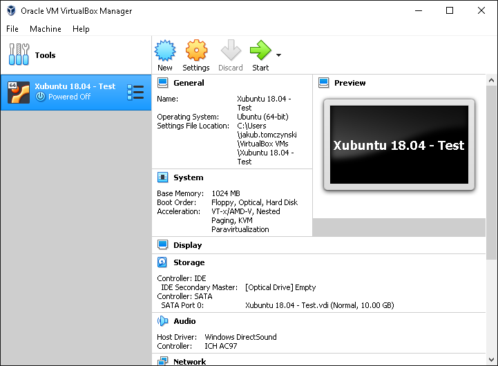

## Instalacja systemu

* Pobierz obraz *ISO* płyty instalacyjnej ze strony https://xubuntu.org/download/ - wersja 20.04.\*, *Desktop* dla architektury 64-bit - wybierz serwer (*mirror*) z pobliskiego kraju, a następnie odpowiedni plik ISO (aktualnie *xubuntu-20.04.3-desktop-amd64.iso*).

* Uruchom maszynę kilkając *Start*. Maszyna domyślnie ustawiona jest na boot z wirtualnego napędu CD. Przy pierwszym uruchomieniu maszyny VirtualBox poprosi o wskazanie obrazu ISO płyty:

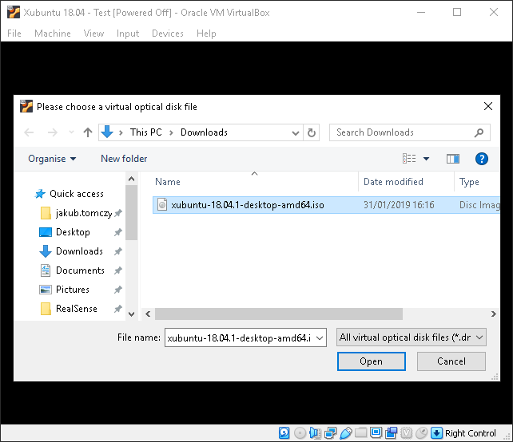

| Podpowiedź: obsługa maszyny wirtualnej |
| ------------- |
| Kiedy aktywne jest okno maszyny wirtualnej, wszystkie naciśnięcia klawiszy przekazywane są do systemu gościa. Kliknięcie w obszarze obrazu maszyny spowoduje także przechwycenie kursora. Uwolnienie kursora i wyłączenie przechwytywania klawiszy może wymagać naciśnięcia tzw. *host key*. Aktualnie ustawiony host key wyświetlany jest w prawym dolnym rogu okna maszyny, pod systemem Windows domyślnie jest to *prawy control*. |

* Pobrany obraz to tzw. *Live-CD*, co oznacza, że system można uruchomić bezpośrednio z płyty, bez konieczności instalacji, w celu np. przetestowania lub awaryjnego naprawienia istniejącego systemu. Podczas zajęć będziemy się posługiwać trwałą instalacją, dlatego wybierz opcję *Install Xubuntu*, pozostawiając domyślny, angielski język systemu.

* Wybierz układ klawiatury *Polish*/*Polish*, przejdź dalej przyciskiem *Continue*.


* Wszystkie pozostałe opcje mogą pozostać domyślne, przejdź przez kolejne etapy instalacji przyciskiem *Continue*.

    * Typ instalacji (Installation type)
    
        Podczas instalacji na maszynie wirtualnej możesz bez obaw wybrać usunięcie danych i użycie całego dysku - opcja *Erase disk and install Xubuntu*. Jedyne do czego ma dostęp maszyna wirtualna, to uprzednio stworzony obraz wirtualnego dysku. Podczas ewentualnej instalacji na fizycznym komputerze masz możliwość instalacji obok istniejącego systemu operacyjnego (np. Windows) wraz z *bootloaderem* pozwalającym na wybór systemu podczas uruchamiania. Wymaga to jednak podziału dysku na partycje oraz pewnej wiedzy i doświadczenia.
        
        **WAŻNE: Przed instalacją jakiegokolwiek systemu na fizycznym komputerze, na którym znajdują się dane WYKONAJ KOPIĘ ZAPASOWĄ**

* Podaj dane użytkownika i nazwę komputera.

    Podczas zajęć posługujemy się loginem *student*, nazwą komputera *vbox-xubuntu-rtos* i hasłem *Over9000*

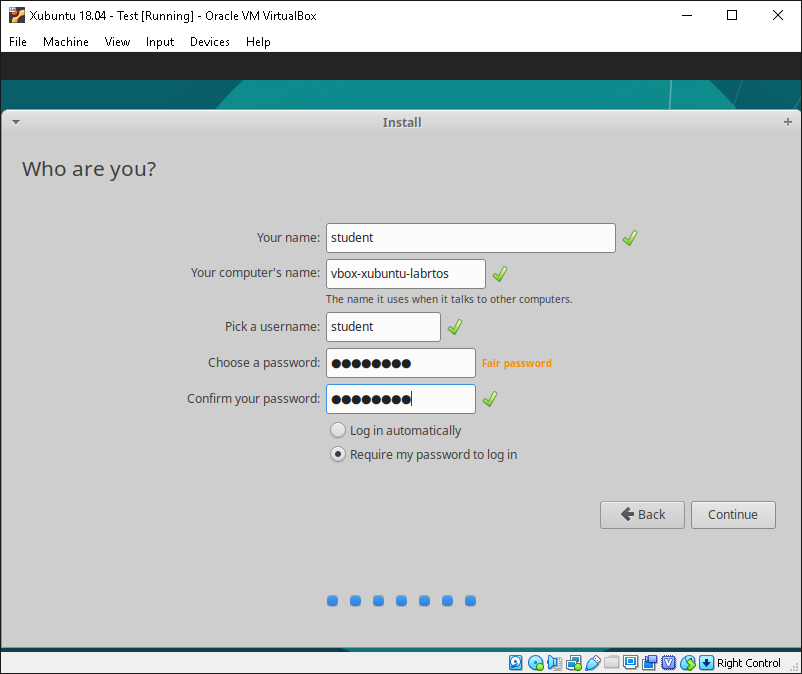

* Po zakończeniu zatwierdź prośbę o restart maszyny. Instalator poprosi o wyjęcie płyty z napędu (VirtualBox zrobi to automatycznie), co potwierdź naciskając *Enter*. Po ponownym uruchomieniu zostaniesz powitany graficznym interfejsem użytkownika. Zaloguj się podając hasło użyte podczas instalacji.

| Ustawienia zarządzania energią pod Windows 10 |
| ------------- |
| Podczas pracy na laptopie zasilanym z baterii, system Windows 10 może nadmiernie ograniczać wydajność maszyny wirtualnej w celu wydłużenia czasu pracy na baterii. Jeśli maszyna wirtualna zdaje się mieć niespodziewanie niską wydajność, spróbuj zmienić bieżący profil zasilania klikając na ikonę baterii na pasku zadań systemu Windows. |

## Instalacja kompilatora i dodatków systemu gościa

Świeżo po instalacji systemu gościa VirtualBox musi w pełni symulować niektóre urządzenia sprzętowe. Wydajność i wygodę obsługi maszyny wirtualnej można poprawić instalując tzw. dodatki gościa (*Guest Additions*).

* Dla systemów goszczonych Windows od wersji NT dodatki są dostarczone w formie graficznego instalatora.
    
* Dla systemów goszczonych Linux, aby osiągnąć pełną funkcjonalność, instalator musi skompilować tzw. *moduły jądra* (sterowniki) dedykowane dla wirtualizowanego sprzętu i systemu, co będzie wymagało zainstalowania kompilatora.
    
### Instalacja kompilatora i pierwsze kroki w terminalu
    
* Programy i biblioteki dla wielu dystrubucji dostarczane są w formie *pakietów* (paczek), którymi zarządza menadżer paczek używany w danej dystrybucji. Menadżer ten automatycznie rozwiązuje *zależności* pomiędzy paczkami (dany program może wymagać do działania innego programu lub specyficznych bibliotek), pobiera je z *repozytoriów* i instaluje w systemie.

    * Współczesne dystrybucje dostarczają też często graficzny \"sklep\" z popularnymi aplikacjami użytkowymi.
    
* W systemach z rodziny Debian (w tym Ubuntu i pochodne) wykorzystywany jest menadżer paczek *APT* (*Advanced Packaging Tool*). Paczki przechowywane są w archiwach *.deb*. Funkcje *APT* są dostępne z poziomu linii poleceń pod komentą `apt`.

Uruchom aplikację *Terminal Emulator* korzystając z ikony menu Xubuntu w lewym górnym rogu. Jeśli nie wyświetla się na liście, możesz wpisać w wyszukiwarce \"terminal\". Powinno pojawić się następujące okno:

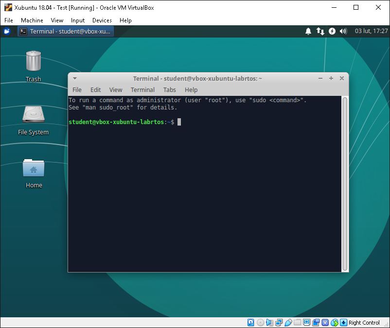

Linia poleceń zawiera m.in. Twoją nazwę użytkownika i nazwę komputera, a na końcu *znak zachęty* ($). Po znaku zachęty możesz wpisywać polecenia do wykonania, zatwierdzane enterem.

Sprawdź czy Twoja maszyna ma połączenie z Internetem, odpytując znany serwer. Domyślna konfiguracja VirtualBoxa powinna zapewniać udostępnienie połączenia z hosta do gościa. Wykonaj polecenie `ping` wraz z adresem, który ma odpytać.

```bash
ping www.google.com
```

W terminalu co sekundę powinna pokazywać się odpowiedź od serwera.

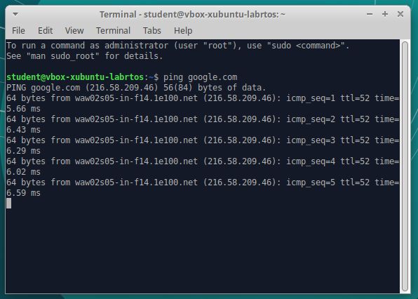

Działanie programów konsolowych możesz przerwać skrótem klawiszowym *control-c*. Pamiętaj, że prawy control jest skonfigurowany jako specjalny *klawisz hosta*, zatem do skrótów używaj lewego klawisza control. Przerwij działanie polecenia `ping`.

Spróbuj zainstalować pakiet `build-essential`, który spowoduje zainstalowanie kompilatora i wszystkich niezbędnych narzędzi. Wykonaj polecenie:

```bash
apt install build-essential
```

Polecenie odpowie komunikatem o braku wymaganych uprawnień. Dodaj na początku polecenia komendę `sudo`, co oznacza w uproszczeniu *uruchom jako administrator*:

```bash
sudo apt install build-essential
```

Polecenie `sudo` zapyta o hasło - wpisz swoje hasło użytkownika podane podczas instalacji. Menadżer wyświetli listę paczek, które zostaną zainstalowane jako zależności i zapyta o potwierdzenie. Domyślna odpowiedź wyróżniona jest wielką literą (*Y*), zatwierdź instalację klawiszem *Enter*.

### Instalacja dodatków

Z menu w oknie z maszyną wirtualną wybierz *Devices* &rarr; *Insert Guest Additions CD image*. Xubuntu powinno automatycznie otworzyć okno przeglądarki plików. Zwróć uwagę na ścieżkę, pod jaką znajduje się zawartość płyty.

Wróć do okna terminala i uruchom polecenie `autorun.sh` z płyty. Ponieważ program znajduje się na płycie, podaj pełną ścieżkę do polecenia, podmieniając ewentualnie numer wersji dodatków na aktualny:

```bash
/media/student/VBox_GAs_6.0.4/autorun.sh
```
Instalator zapyta ponownie o hasło użytkownika, a następnie wyświetli dodatkowe okno terminala z komunikatami. Po zakończeniu instalacji powinno wyglądać następująco:

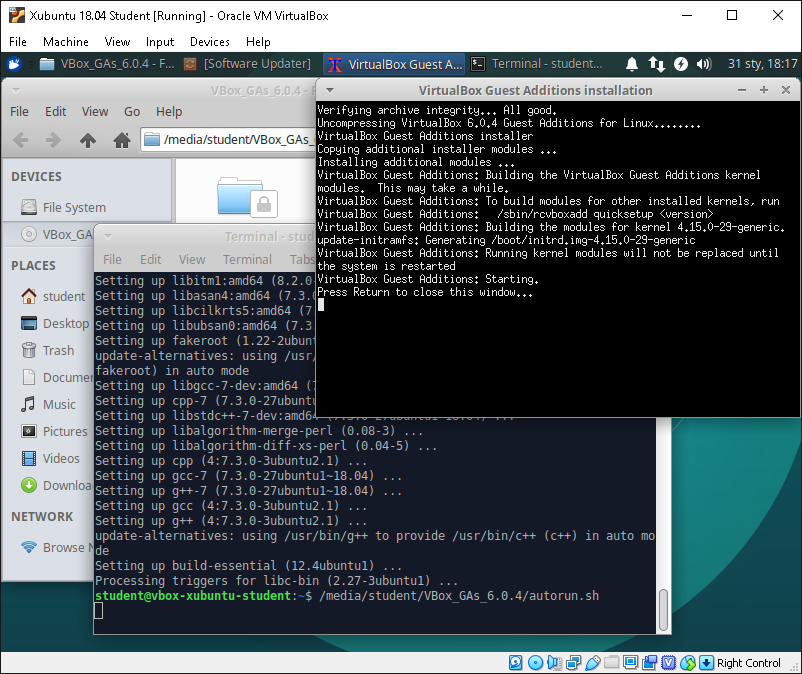

Możesz zamknąć teminale, a następnie usunąć płytę z dodatkami z wirtualnego napędu korzystając z ikony w prawym dolnym rogu. Konieczne może być wymuszenie wyjęcia płyty (*Force Unmount*):

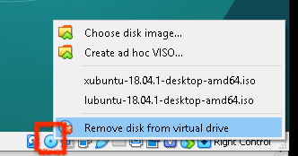

Zrestartuj maszynę wirtualną korzystając z menu Xubuntu:

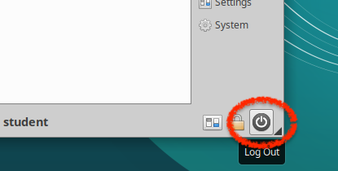

Po ponownym uruchomieniu włącz współdzielony schowek w menu VirtualBoxa: *Devices* &rarr; *Shared Clipboard* &rarr; *Bidirectional*, co znacznie ułatwi Ci przenoszenie informacji pomiędzy gościem a hostem. Od tej pory rozdzielczość systemu gościa będzie się także dopasowywała do rozmiaru okna VirtualBoxa. Możesz przełączyć się na pełny ekran naciskając *przycisk hosta*+*F*.

## Mechanizm migawek w środowisku VirtualBox

Wiele środowisk wirtualizacji, w tym program VirtualBox, pozwala na tworzenie tzw. migawek (ang. *snapshot*) maszyn wirtualnych, czyli zapamiętanych stanów maszyny - m.in. ustawień maszyny, zawartości dysku oraz pamięci operacyjnej. Pozwala to na przykład na bezpieczne testowanie rozwiązań z możliwością wrócenia do zapisanego stanu. Możliwe jest również zapamiętanie stanu uruchomionej maszyny, co pozwala np. wznowić jej działanie od wybranego momentu.

### Przetestuj tworzenie migawek

Wyłącz stworzoną w poprzednich punktach maszynę wirtualną. Stwórz migawkę "czystej" instalacji - świeżo zainstalowanego systemu wraz z dodatkami gościa:

* Przełącz widok opcji na *Snapshots* podświetlając wybraną maszynę i klikając rozwijane menu:

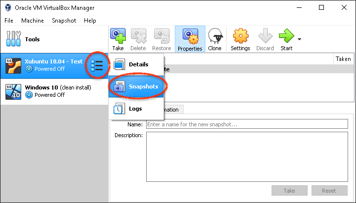

* Stwórz nową migawkę przyciskiem *Take*

    * Nadaj jej nazwę *clean install*

Stan migawek wyświetlany jest w formie drzewa - maszyna może mieć kilka migawek, migawki mogą być też zależne od innych:

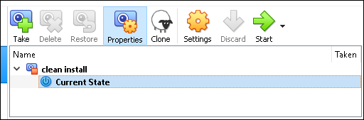

Powyższy widok oznacza, że stan bieżący i wszystkie zmiany jakie w nim znajdą są będą zapisywane jako zmiany względem migawki *clean install*. Co istotne, w migawce przechowywane są jedynie faktyczne zmiany na dysku - posiadanie wielu migawek nie musi oznaczać, że zajmują one bardzo dużo przestrzeni dyskowej.

Uruchom maszynę wirtualną i dokonaj drobnych zmian w systemie - np. zmień tapetę, utwórz na pulpicie dokument tekstowy, usuń folder *Videos* z katalogu domowego.

Wyłącz system gościa, a następnie przywróć zapisany wcześniej system zaznaczając migawkę *clean install* i kilkając *Restore*. VirtualBox zapyta, czy chcesz zapisać zmiany, które wprowadziłeś od czasu utworzenia migawki *clean install* jako nową migawkę - zrezygnuj z tej opcji deaktywując pole wyboru *Create a snapshot of the current machine state*:

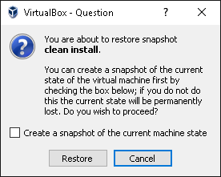

Sprawdź czy przywrócenie się powiodło - po uruchomieniu maszyny nie powinno być zmian, które wprowadziłeś od chwili zrobienia migawki.

Poza przywracaniem masz możliwość:

* *Delete*: usunięcia migawki 
* *Clone*: utworzenia nowej maszyny na podstawie migawki
* *Discard*: wymuszenia wyłączenia maszyny, której stan został zapisany podczas gdy była uruchomiona

Pozostaw migawkę *clean install* na komputerze w laboratorium, tak aby zawsze móc wrócić do działającego systemu.

## Poznaj nowy system!

Do poleceń terminala wrócimy na kolejnych laboratoriach, a na razie - poznaj nowy system od bardziej przyjaznej, graficznej strony!

Uruchom przeglądarkę plików, sprawdź jakie aplikacje i opcje są dostępne w menu. Zajrzyj do ustawień, eksperymentuj. To tylko maszyna wirtualna, którą zawsze możesz w łatwy sposób przywrócić do sprawnej migawki lub skonfigurować od zera bez obaw o system, na którym pracujesz na co dzień.

***
Autor: *Jakub Tomczyński*\
Edytowane przez: *Bartłomiej Kulecki*
