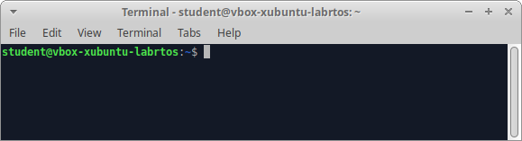
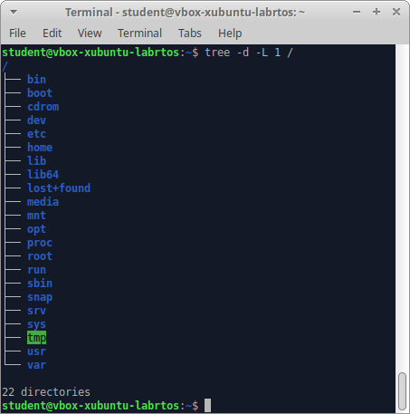
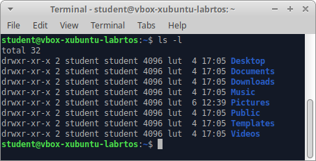

# Wprowadzenie oraz obsługa systemu plików

## Początek pracy, logowanie do systemu

Podczas tego ćwiczenia poznamy podstawy pracy z systemem Linux przy wykorzystaniu najpopularniejszej, domyślnej powłoki *bash*. Aby uzyskać dostęp do powłoki, należy uruchomić aplikację *Terminal Emulator* z menu startowego interfejsu graficznego systemu.



Po uruchomieniu terminala wyświetlana jest linia poleceń wraz z nazwą użytkownika (*student*), nazwą maszyny (*vbox-xubuntu-labrtos*) oraz znak zachęty $. Oznacza to, że zalogowany użytkownik jest użytkownikiem zwykłym. Oprócz tego wyróżniamy, użytkownika uprzywilejowanego *root* posiadającego pełne prawa administracyjne do systemu. W takim wypadku, znak zachęty zmienia się na #, a nazwa użytkownika na *root*. Po znaku zachęty możemy wprowadzać kolejne polecenia zatwierdzanie klawiszem *Enter*.

Po zalogowaniu do systemu użytkownik ma możliwość zmiany własnego hasła - służy do tego polecenie:
```bash
passwd
```
Po jego wydaniu należy wprowadzić dotychczasowe hasło, a następnie nowe hasło, które trzeba także powtórzyć, aby system mógł zweryfikować czy nie popełniono błędu przy jego wprowadzaniu (np. "literówki"). W trakcie wpisywania hasła, ze względów bezpieczeństwa na monitorze nie są wyświetlane żadne znaki. System identyfikuje użytkowników na podstawie specjalnych identyfikatorów numerycznych (takie numery są łatwiejsze do przetwarzania) - nazywanych **id**. Każdy użytkownik systemu operacyjnego może także sprawdzić jaki identyfikator numeryczny **id** został mu przydzielony - należy wówczas zastosować polecenie:
```bash
id
```
którego wynik może być następujący:
```bash
uid=1000(student) gid=1000(student) groups=1000(student),4(adm),24(cdrom)...
```
gdzie *uid* (ang. *user identifier*) oznacza identyfikator użytkownika, w nawiasie znajduje się jego nazwa, *gid* (ang. *group identifier*) oznacza identyfikator grupy - każdy użytkownik należy do pewnej grupy, tzw. grupy podstawowej (dla powyższego przykładu jest to grupa o identyfikatorze 1000 i nazwie student), dodatkowo każdy użytkownik może należeć do innych grup, są one wymienione po słowie *groups*.

Wielodostępność oznacza także, że każdy użytkownik może zalogować się do systemu wielokrotnie, korzystając np. z terminali wirtualnych dostępnych za pomocą klawiszy `Ctrl-Alt-F1`, `Ctrl-Alt-F2` itd. Domyślnie, środowisko graficzne dostępne jest pod terminalem *tty7* (`Ctrl-Alt-F7`) Możliwe jest także pozyskanie informacji o wszystkich zalogowanych aktualnie w systemie użytkownikach - aby tego dokonać należy wydać polecenie:
```bash
who
```
Aby wylogować się z systemu, należy wydać polecenie:
```bash
exit
```
W przypadku graficznej aplikacji *Terminal Emulator* spowoduje to zakończenie jej działania. W przypadku pracy w trybie tekstowym, bezpośrednio w powłoce *bash* polecenie `exit` powoduje wylogowanie użytkownika z danej sesji terminala.

## Wydawanie poleceń

Polecenia w systemie Linux mogą przyjmować **argumenty** oraz **przełączniki**, zgodnie ze wzorcem:
```bash
polecenie [przełączniki] [argumenty]
```
Oto przykład:
```bash
ls -al /etc
```
W tym przypadku polecenie `ls` zostało uruchomione z argumentem `/etc` oraz z przełącznikami `al`. Wydanie polecenia `ls` bez argumentu spowoduje wyświetlenie zawartości aktualnego katalogu; podanie natomiast jako argumentu nazwy katalogu, spowoduje wyświetlenie zawartości tego, wskazanego katalogu - w przykładzie jest to katalog `/etc`. Dalej, domyślne działanie polecenia można modyfikować stosując przełączniki, które są przeważnie jednoznakowymi skrótami, zawsze występującymi po znaku "-". W przykładzie zastosowano dwa przełączniki `a` i `l`. Opis możliwych do zastosowania argumentów i przełączników można odnaleźć w pomocy systemowej dla właściwego polecenia. Przełączniki, jak widać, można łączyć - kolejny przykład przedstawia jak można wydawać polecenie z przełącznikami:
```bash
ls -a -l /etc
```
```bash
ls -l -a /etc
```
```bash
ls -al /etc
```
```bash
ls -la /etc
```
Każde z pokazanych powyżej poleceń jest równoważne i skutkuje wykonaniem tej samej operacji. Przełączniki wieloznakowe podawane są z wykorzystaniem dwuznaku `--`.

***
##  Garść porad i wskazówek:

Dla efektywnej pracy z terminalem warto poznać kilka przydatnych "sztuczek": 
*  Podczas wpisywania poleceń, ścieżek dostępu itp. naciskając klawisz `Tab` terminal uzupełni dalszą część polecenia, jeśli jest tylko jedno możliwe dopełnienie. Jeśli możliwości jest kilka, dwukrotne naciśnięcie `Tab` wyświetli możliwe dopełnienia.
* Naciskając klawisze strzałek góra-dół w trakcie pracy z linią poleceń, możemy w łatwy sposób poruszać się pomiędzy wydawanymi w tej sesji poleceniami.
*  Szerszy dostęp do historii komend uzyskamy naciskając `Ctrl+R` i wyszukując odpowiednie polecenie
*  Polecenie `clear` powoduje wyczyszczenie ekranu terminala.
* Wpisanie `!!` automatycznie zastępuje ostatnio wydane polecenie. Przykładowo, jeżeli zapomnimy wykonać skomplikowanej komendy z uprawnieniami użytkownika *root*, wystarczy, że w kolejnym kroku wpiszemy `sudo !!`.
*  Aby wydać kilka poleceń w jednej linii, możemy odseparować kolejne komendy znakami `&&` lub `;`. W pierwszym przypadku, kolejne polecenia będą wykonywać się tylko wtedy, gdy poprzednie nie zakończą się błędem. Oddzielenie średnikiem powoduje sekwencyjne wykonanie komend bez zwracania uwagi na rezultat operacji.
 ***

## Pomoc systemowa
W systemie Linux dla każdego polecenia dostępna jest pomoc systemowa opisująca różne aspekty i zastosowania danego narzędzia oraz dostępne przełączniki. Jednym z mechnizmów pozwalających na wyświetlenie plików pomocy jest wywołanie polecenia z przełącznikiem `--help`, np:
```bash
ls --help
```
powoduje wyświetlenie opisu działania wszystkich przełączników, odniesień do dokumentcji zewnętrznej i innych przydatnych informacji.

Bardziej rozbudowaną dokumentację poleceń można uzyskać poprzez wywołanie:
```bash
man nazwa_polecenia
```
Powoduje to uruchomenie interaktywnej przeglądarki plików pomocy dla podanego programu lub usługi.
Pomoc systemowa wyświetlana jest za pomocą przeglądarki *more*, którą obsługuje się za pomocą następujących poleceń klawiszowych:

* `Spacja` - przejście do następnej strony;
* `Ctrl+B` - przejście do poprzedniej strony;
* `q` - zamknięcie i opuszczenie przeglądarki;
* `/` - wyszukiwanie tekstu w przód, po znaku / należy wpisać tekst do wyszukania;
* `?` - wyszukiwanie w tył;
* `n`, `N` - przejście do następnego (n)/poprzedniego (N) wystąpienia poszukiwanego wyrażenia.

## Struktura katalogów

Katalog jest strukturą, która umożliwia porządkowanie i grupowanie danych, jakie są przechowywane na dysku komputera. Katalogi mają strukturę hierarchiczną - w każdym katalogu mogą być przechowywane zarówno pliki, jaki i katalogi niższych poziomów. W systemach UNIX wszystkie dostępne systemy plików postrzegane są przez użytkownika jako jedna struktura katalogów, której wierzchołkiem jest tzw. katalog główny, oznaczany symbolem '' `/` ''. Jeśli w systemie dostępnych jest kilka systemów plików to jeden z nich jest systemem głównym, a pozostałe są do niego montowane. Regułą jest także, że każdy użytkownik posiada tzw. katalog domowy, zwykle jest to podkatalog katalogu `home`, w którym użytkownik może przechowywać własne pliki.



Postać systemu plików systemów UNIX jest w dużej części ustandaryzowana - oto najistotniejsze podkatalogi katalogu głównego:

* `/bin` - katalog zawierający programy niezbędne do uruchomienia systemu;
* `/dev` - katalog zawierający pliki specjalne, które reprezentują dostępne urządzenia;
* `/etc` - katalog z lokalnymi plikami konfiguracyjnymi systemu;
* `/home` - w tym katalog znajdują się podkatalogi domowe użytkowników systemu;
* `/proc` - wirtualny system plików, który dostarcza informacji o bieżących prcesach w systemie i jego jądrze;
* `/root` - zwyczajowo katalog domowy użytkownika *//root//*, czyli administratora systemu;
* `/usr` - katalog zawierający zestaw oprogramowania użytkowego dostępnego dla użytkowników;
* `/var` - katalog ten zawiera pliki, które często zmieniają swoją zawartość i/lub rozmiar.

Dokładniejszy opis struktury katalogów systemu dostępny jest w pomocy systemowej `hier(7)` - aby uzyskać do niego dostęp należy wydać polecenie:

```bash
man 7 hier
```

Informacja o katalogu bieżącym jest wyświetlana po wydaniu polecenia:

```bash
pwd
```

Jak wspomniano symbol `/` oznacza katalog główny, używa się także innych symboli dla określenia wybranych katalogów:

* `.` - oznacza katalog bieżący,
* `..` - oznacza katalog bezpośrednio nadrzędny;
* `~` - oznacza katalog domowy użytkownika.

## Obsługa katalogów

Podstawowe operacje obsługi katalogów można realizować z wykorzystaniem następujących poleceń:

* `cd [przełączniki] nazwa_katalogu` - zmiana katalogu, np.:
  * `cd /etc` - zmienia katalog bieżący na katalog `/etc`;
  * `cd ~` - zmienia katalog bieżący na katalog domowy użytkownika;
  * `cd ..` - zmienia katalog bieżący na katalog bezpośrednio nadrzędny.
* `ls [przełączniki] [nazwa_katalogu]` - wyświetlenie zawartości katalogu, np.:
  * `ls` - wyświetla zawartość katalogu bieżącego;
  * `ls -a` - wyświetla zawartość katalogu bieżącego uwzględniając wszystkie pliki - tzn. także te, których nazwa zaczyna się od znaku `.` (umownie są to pliki ukryte);
  * `ls -l` - wyświetla wszystkie pliki z katalogu bieżącego z uwzględnieniem tzw. "długiego formatu", czyli podając typ każdego obiektu w katalogu (pierwszy znak linii: `d` - katalog, znak `-` - plik zwykły, `l` - dowiązanie), prawa dostępu, liczbę dowiązań, właściciela, nazwę grupy, rozmiar (w bajtach), data ostatniej modyfikacji oraz nazwę (patrz rysunek poniżej)
  
    
  * `ls -al ~` - jak wyżej, przy czym wyświetlana jest zawartość katalogu domowego wraz z plikami ukrytymi;
  * `ls -al /etc` - jak wyżej, ale wyświetlana jest zawartość katalogu `/etc`.
* `mkdir [przełączniki] nazwa_katalogu` - tworzenie katalogów, np.:
  * `mkdir ./xyz` - utworzenie katalogu `xyz` w katalogu bieżącym;
  * `mkdir ../xyz` - utworzenie katalogu `xyz` w katalogu bezpośrednio nadrzędnym.
* `rmdir [przełączniki] nazwa_katalogu` - usuwanie katalogów, np.:
  * `rmdir ~/xyz` - usunięcie katalogu `xyz` z katalogu domowego;
  * `rmdir ./xyz` - usunięcie katalogu `xyz` z katalogu bieżącego.

## Obsługa plików

Plik to zdefiniowana (przeważnie przez użytkownika) porcja danych, która jest przechowywana w systemie w pamięci masowej. W systemach UNIX niemal wszystko jest plikiem, także urządzenia są reprezentowane przez specjalne pliki. Pozwala to, na zachowanie spójnego sposobu dostępu i obsługi do wielu heterogenicznych zasobów, w jeden transparentny sposób. Nazwy plików nie mają podziału na nazwę i rozszerzenie, jednakże można takie podejście stosować; możliwe jest stosowanie w nazwach plików znaków specjalnych (np.: `$`, `%` lub `#`), ale nie jest to zalecane.

Podstawowe operacje obsługi plików można realizować z wykorzystaniem następujących poleceń:


* `cp [przełączniki] nazwa_pliku nowa_nazwa_lub_katalog` - kopiowanie pliku określonego przez pierwszy argument pod nazwę lub do katalogu określonego drugim argumentem, np.:
  * `cp abc.txt xyz.txt` - kopiuje plik `abc.txt` pod nową nazwę `xyz.txt` w katalogu bieżącym;
  * `cp /tmp/abc.txt ~` - kopiuje plik `abc.txt` z katalogu `/tmp` do katalogu domowego użytkownika;
  * `cp abc.txt ~/xyz.txt` - kopiuje plik `abc.txt` z katalogu bieżącego pod nową nazwę `xyz.txt` w katalogu domowym użytkownika.
  
Przydatnym przełącznikiem polecenia `cp` jest przełącznik `-r`, który służy do kopiowania całych struktur katalogów.

* `rm [przełączniki] lista_plików` - usuwanie plików podanych jako argumenty wywołania, np.:
  * `rm abc.txt xyz.txt` - usuwa pliki `abc.txt` i `xyz.txt` w katalogu bieżącym
  * `rm /tmp/abc.txt` - usuwa plik `abc.txt` z katalogu `/tmp`

Przydatnym przełącznikiem polecenia `rm` jest przełącznik -r, który służy do usuwania całych struktur katalogów.

* `mv [przełączniki] nazwa_pliku nowa_nazwa` - zmiana nazwy pliku określonego pierwszym argumentem wywołania na nazwę określoną drugim argumentem wywołania. Jeśli drugi argument wywołania jest katalogiem, to wówczas plik zostanie przeniesiony do tego katalogu, np.:
  * `mv abc.txt xyz.txt` - zmiana nazwy pliku `abc.txt` na nazwę `xyz.txt` w katalogu bieżącym;
  * `mv /tmp/abc.txt ~` - przeniesienie pliku `abc.txt` z katalogu `/tmp` do katalogu domowego użytkownika.
  
* `touch [przełączniki] nazwa_pliku` - modyfikuje informacje na temat czasów modyfikacji i odczytu pliku, ale pozwala także na utworzenie pliku, np.:
  * `touch abc.txt` - utworzenie (pustego) pliku `abc.txt` w katalogu bieżącym.
  
Polecenia dotyczące plików (i katalogów) można także wydawać z wykorzystaniem tzw. wzorców uogólniających, które tworzy się z zastosowaniem następujących operatorów:

`*` - zastępuje dowolny ciąg znaków (także pusty),

`?` - zastępuje dokładnie jeden dowolny znak,

`[<znaki>]` - zastępuje dokładnie jeden znak z podanego zakresu, np.: `[xyz]`

`[^<znaki>]` - znak ^ na początku oznacza dopełnienie zbioru, czyli dla  przykładu `[^xyz]`, oznacza dowolny znak nie będący literą `x, y` i `z`.

Oto przykładowe polecenia z wykorzystaniem wzorców uogólniających:

`cp ./*.txt ~` - kopiowanie wszystkich plików z rozszerzeniem .txt z katalogu bieżącego do katalogu domowego użytkownika,

`rm ~/[0-9]*` - usunięcie wszystkich plików z katalogu domowego, których nazwa rozpoczyna się od cyfry.

## Zadania do samodzielnego wykonania - część I

1. Zmień własne hasło. Następnie powróć do hasła domyślnego.
2. Sprawdź własny identyfikator oraz grupy, do których należysz.
3. Sprawdź kto jest zalogowany w chwili obecnej w systemie.
4. Zapoznaj się z opisem struktury katalogów - polecenie `man 7 hier`.
5. Wyświetl zawartość katalogu domowego.
6. Wyświetl zawartość podstawowych katalogów w systemie (np. `/dev`, `/etc`, `/home`, `/usr`).
7. Utwórz katalog `kat1` w katalogu domowym.
8. W katalogu `kat1` utwórz jednym poleceniem strukturę katalogów `kat2/kat3/kat4`.
9.  Usuń jednym poleceniem cała strukturę katalogów `kat3/kat4`.
10. Utwórz w katalogu domowym pliki o dowolnych nazwach z rozszerzeniami `.txt` i `.c`. (po 2-3 pliki z każdym z rozszerzeń)
11. Skopiuj jednym poleceniem wszystkie pliki z katalogu domowego z rozszerzeniem `.txt` do katalogu `kat1`.
12. Skopiuj jednym poleceniem wszystkie pliki z katalogu domowego z rozszerzeniem `.c` do katalogu `kat2`.
13. Skopiuj całą strukturę katalogów `kat1` tworząc analogiczną strukturę o nazwie `kat1b`.
14. Usuń wszystkie pliki z katalogu `kat1/kat2`.
15. Usuń jednym poleceniem całą strukturę katalogów `kat1b`.
16. Zmień nazwę dowolnego pliku w katalogu `kat1`.
17. Przenieś katalog `kat1/kat2` do katalogu domowego tworząc w ten sposób katalog `kat2b`.

## Wyszukiwanie plików

Jak już wspomniano pliki w systemach UNIX są używane do przechowywania danych użytkowników oraz reprezentują m. in. niektóre urządzenia systemowe, istotne jest zatem sprawne wyszukiwanie i lokalizowanie plików w strukturze katalogów. Zadanie to można zrealizować na kilka sposobów, w zależności od charakteru poszukiwanego pliku i kryteriów wyszukiwania.

Lokalizacji plików wykonywalnych - programów - można dokonać z wykorzystaniem polecenia:

```bash
whereis [przełączniki] lista_programów
```

Wynikiem działania tego polecenia jest informacja o pełnej ścieżce do pliku oraz lokalizacja pliku z pomocą systemową dla wyszukiwanego programu - przykład:

```bash
whereis ls
ls: /bin/ls /usr/share/man/man1/ls.1.gz
```

Przeszukiwanie struktury katalogów systemu w poszukiwaniu plików (i katalogów) można zrealizować stosując polecenie:

```bash
find katalog kryteria
```

Pierwszym argumentem wywołania polecenia `find` jest nazwa katalogu, od którego ma się rozpocząć poszukiwanie; drugi argument dotyczy kryteriów jakie mają dotyczyć wyszukiwania. Specyfikacja kryteriów wyszukiwania to koniunkcja kryteriów, z których najczęściej używane to:

* `name <nazwa>` - pozycje o podanej nazwie (można także stosować operatory uogólniające) - rozróżniana jest jednak wielkość liter;
* `iname <nazwa>` - pozycje o podanej nazwie (można także stosować operatory uogólniające) - brak rozróżniania wielkości liter;
* `size <rozmiar><jednostka>` - pozycje o określonym rozmiarze - możliwe są następujące określenia jednostek: `c` - bajty, `k` - kilobajty, `w` - dwubajtowe słowa, brak jednostki oznacza 512-bajtowe bloki; przed rozmiarem można podać znaki `+` lub `-`, oznaczają one wówczas odpowiednio: pozycje o rozmiarze większym/mniejszym niż podany;
* `atime <dni>` - pozycje, na których była wykonywana jakaś operacja podaną liczbę dni temu; przed ilością dni można podać znaki `+` lub `-`, oznaczają one wówczas odpowiednio: pozycje, na których była wykonywana jakaś operacja więcej/mniej dni temu;
* `mtime <dni>` - pozycje, na które były modyfikowane podaną liczbę dni temu; przed ilością dni można podać znaki + lub -, oznaczają one wówczas odpowiednio: pozycje, na które były modyfikowane więcej/mniej dni temu;
* `type <typ>` - określenie jakie pozycje mają zostać odnalezione: `f` - pliki zwykłe, `d` - katalogi, `l` - dowiązania symboliczne, `c` - urządzenia znakowe (niebuforowane), `b` - urządzenia blokowe (buforowane), `p` - kolejki FIFO;
* `exec <polecenie> [{}] \;`; - wykonuje dowolne polecenie; polecenie może zostać wykonane na odszukanych pozycjach, wówczas należy zastosować jako argument polecenia znaki `{}`.
  
Oto przykłady użycia polecenia find:

* `find ~ -name abc.txt` - wyszuka wszystkie pozycje o nazwie `abc.txt`, które znajdują sie w katalogu domowym użytkownika (oraz podkatalogach);
* `find ~/temp -name "*.txt"` - wyszuka wszystkie pozycje o nazwie z rozszerzeniem `*.txt*`, które znajdują sie w katalogu `temp` (oraz jego ewentualnych podkatalogach) w katalogu domowym użytkownika ;
* `find ~ -iname "*.txt" -type f -size +100k` - wyszuka wszystkie pliki zwykłe w katalogu domowym użytkownika (i jego podkatalogach), które mają rozszerzenie `.txt` - wielkość liter bez znaczenia - oraz rozmiar większy niż 100kB;
* `find /tmp -type f -atime +2 -exec rm {} \; -print` - wyszuka wszystkie pliki zwykłe w katalogu `/tmp` (oraz jego podkatalogach), na których nie były wykonywane żadne operacje w ciągu ostatnich 48 godzin oraz usunie wszystkie odnalezione pliki; dodatkowy przełącznik `-print` powoduje, że zostaną wyświetlone nazwy odnalezionych plików, pomimo wykonania na nich dodatkowej operacji (tutaj `rm`).

## Zadania do samodzielnego wykonania - część II


18.   Korzystając z programu find znajdź wszystkie pliki, które posiadają w nazwie słowo `mozilla` i znajdują się w podkatalogach katalogu `/usr`.
19.   Korzystając z programu `find` znajdź wszystkie katalogi o nazwie `bin`, które znajdują się w katalogu `/usr`.
20.   Skopiuj wszystkie pliki zwykłe o rozmiarze pomiędzy 10 a 100 bajtów z katalogu `/usr/bin` do katalogu `kat1/kat2` (wykorzystaj polecenie `find` z parametrem `-exec`).
    
## Prawa dostępu

W systemach UNIX dostęp do plików i katalogów zabezpieczony jest tzw. prawami dostępu, które regulują zasady na jakich użytkownicy mogą korzystać z tych zasobów. Wyróżnia się trzy rodzaje praw: prawo odczytu - oznaczane `r` (ang. `read`), prawo zapisu - oznaczane `w` (ang. `write`) oraz prawo wykonania - oznaczane `x` (ang. `execute`). Takie prawa są określane niezależnie dla: użytkownika, który jest właścicielem pliku lub katalogu (domyślnie właścicielem jest użytkownik, który utworzył dany plik lub katalog); użytkowników, którzy należą do tej samej grupy, do której należy plik lub katalog oraz dla pozostałych użytkowników. 

Interpretacja praw dostępu jest następująca:


|            Czynność do wykonania           | Prawa do pliku | Prawa do katalogu |
|:------------------------------------------:|:--------------:|:-----------------:|
|      Przeglądanie zawartości katalogu      |       ---      |        r--        |
|         Utworzenie pliku w katalogu        |       ---      |        -wx        |
|        Zmiana nazwy pliku w katalogu       |       ---      |        -wx        |
|         Usunięcie pliku z katalogu         |       ---      |        -wx        |
|         Odczytanie zawartości pliku        |       r--      |        --x        |
|               Zapis do pliku               |       -w-      |        --x        |
| Wykonanie pliku (np. programu lub skryptu) |       --x      |        --x        |
		

Jak już wspomniano informacje o prawach dostępu można uzyskać dzięki poleceniu `ls` z przełącznikiem `-l` - oto przykład oraz jego interpretacja:

```bash
ls -l
drwx------ 15 adam students 4096 lip  6 13:27 ./
drwxr-xr-x 54 adam students 4096 lip  6 11:20 ../
-rwxr--r-x  2 adam students 4096 cze 23 13:32 abc.txt
```

Informacja o prawach wyświetlana jest według następującego schematu:

| Użytkownik (user) | Grupa (group) | Inni użytkownicy (others) |
|:-----------------:|:-------------:|:-------------------------:|
| r &vert; w &vert; x | r &vert; w &vert; x | r &vert; w &vert; x |

Zatem dla pliku `abc.txt` dostępne są następujące prawa (znak "-" oznacza brak danego prawa): dla właściciela dostępne są wszystkie prawa, dla członków grupy students dostępne jest tylko prawo do odczytu, a dla pozostałych użytkowników prawa odczytu i wykonywania.

Prawami dostępu można także operować stosując notację numeryczną, w której każde prawo ma przypisaną pewną wartość liczbową, i tak: prawo odczytu - `4`; prawo zapisu - `2`, prawo wykonywania - `1`. Tak więc, prawa zapisane numerycznie dla pliku `abc.txt` z powyższego przykładu miałyby następującą postać:

* `745` - 7 oznacza wszystkie prawa dla użytkownika (4 + 2 + 1), 4 oznacza prawo odczytu dla grupy, a 5 oznacza prawo odczytu i wykonywania (4 + 1) dla pozostałych użytkowników.
  
Operowanie prawami dostępu i określaniem prawa własności jest możliwe dzięki następującym poleceniom systemowym:

* `chmod [przełączniki] uprawnienia nazwa_pliku_lub_katalogu` - zmiana praw dostępu wskazanych pierwszym argumentem wywołania dla pliku lub katalogu wskazanym drugim argumentem wywołania; możliwości wywołania tego polecenia przedstawiono poniżej:

| chmod | u<br>g<br>o<br>a | +<br>-<br>= | r<br>w<br>x | lista_plików |
|:-----:|:-------:|:-----:|-------|--------------|

W specyfikacji należy zatem wskazać dla kogo mają być zmienione prawe (`u` - właściciel, `g` - użytkownicy z tej samej grupy, `o` - inni użytkownicy, `a` - wszyscy), (ii) rodzaj zmiany (`+` - dodanie praw, `-` - odjęcie praw, `=` - ustalenie praw) oraz (iii) prawa. Oto przykładowe zlecenia z wykorzystaniem polecenia chmod:

  * `chmod u+w plik.txt` - dodaje prawo zapisu dla właściciela do pliku `plik.txt`;
  * `chmod go-x plik.txt` - usuwa prawo wykonywania dla użytkowników z tej samej grupy i innych do pliku `plik.txt`; 
  * `chmod a=r plik.txt` - ustawia prawa dostępu na tylko do odczytu dla wszystkich użytkowników do pliku `plik.txt`;
  
Polecenie `chmod` umożliwia także określanie praw dostępu w postaci numerycznej, np.:

  * `chmod 777 plik.txt` - ustawia wszystkie prawa, wszystkim użytkownikom do pliku `plik.txt;`
  * `chmod 742` - ustawia prawa odczytu, zapisu i wykonywania właścicielowi, prawo odczytu użytkownikom z tej samej grupy oraz prawo zapisu innym użytkownikom do pliku `plik.txt`;

Dodatkowo, możliwa jest zmiana własciciela lub grupy właścicieli pliku/katalogu:

* `chown [przełączniki] nazwa_nowego_właściciela nazwa_pliku_lub_katalogu` - zmiana właściciela pliku lub katalogu. Ze względu na nieodwracalność ewentualnych zmian, polecenie to jest często zarezerwowane dla administratora systemu.
  
* `chgrp [przełączniki] nazwa_nowej_grupy nazwa_pliku_lub_katalogu` - zmienia grupę, do której należy wskazany plik lub katalog. Podobnie jak polecenie chown, i to polecenie najczęściej jest zarezerwowane dla administratora.


## Dowiązania

Dowiązania do plików są to dodatkowe nazwy dla pliku, umożliwiające dostęp do oryginału (np. z poziomu różnych katalogów). Pewną analogią są skróty w systemie *MS Windows*.

Istnieją dwa rodzaje dowiązań: tzw. dowiązania twarde (ang. *hard links*) oraz tzw. dowiązania miękkie lub symboliczne (ang. *soft or symbolic links*). Dowiązania symboliczne mogą także dotyczyć katalogów, oraz plików w innych systemach plików - informacja o nich dostępna jest dzięki omówionemu już poleceniu `ls -l`. Wszystkie dowiązania można przetwarzać dokładnie tak samo jak pliki zwykłe, w szczególności mogą także być usunięte poleceniem `rm`.

Tworzenie dowiązań jest możliwe dzięki poleceniu:

* `ln [przełączniki] źródło nazwa_dowiązania`
  
Pierwszy argument musi wskazywać na istniejący plik (lub katalog w przypadku dowiązań symbolicznych), do którego tworzone jest dowiązanie, a drugim argumentem jest nowa nazwa dla tego pliku. Utworzenie dowiązania symbolicznego wymaga zastosowania przełącznika `-s`. 

Przykładowe wywołania zlecenia utworzenia dowiązań:

* `ln ./abc/plik.txt plik1.txt` - tworzy dowiązanie (twarde) do pliku `plik.txt` w katalogu `./abc` pod nazwą `plik1.txt` w katalogu bieżącym;
* `ln -s ./abc/plik.txt ~/plik1.txt` - tworzy dowiązanie symboliczne do pliku `plik.txt` w katalogu `./abc` pod nazwą `plik1.txt` w katalogu domowym użytkownika.


## Zadania do samodzielnego wykonania - część III 

21.   W katalogu domowym utwórz plik o nazwie plik.txt - sprawdź jakie są prawa dostępu do niego.
22.   Dla pliku plik.txt dodaj prawo zapisu dla pozostałych użytkowników.
23.   Dla pliku plik.txt odejmij prawo zapisu dla właściciela.
24.   Dla pliku plik.txt dodaj prawo wykonywania dla wszystkich użytkowników.
25.   Dla pliku plik.txt i wszystkich użytkowników zezwól jedynie na odczyt pliku.
26.   Dla pliku plik.txt przywróć oryginalne prawa korzystając z notacji numerycznej.
27.   Utwórz dowiązanie do pliku plik.txt o nazwie plik2.txt w katalogu domowym.
28.   Utwórz dowiązanie symboliczne do katalogu kat1/kat2 o nazwie abc w katalogu domowym.
29.   Przejrzyj pomoc systemową dla wszystkich poleceń zaprezentowanych podczas zajęć.

***
Autor: *Adam Bondyra*

Opracowano na podstawie materiałów projektu *Otwartych Studiów Informatycznych (http://wazniak.mimuw.edu.pl/*).
